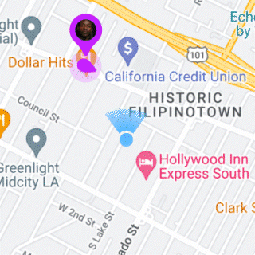
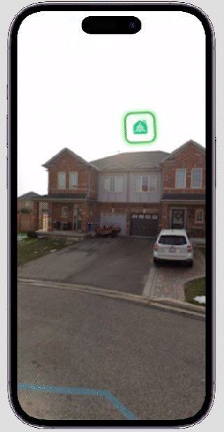

# Hapstr AR SDK Github readme.md

Created: October 5, 2022 5:20 AM
Last Edited Time: November 3, 2022 12:16 AM

# What is HapSTR AR?

HapSTR is an AR Streetview app, you can explore the city with AR on HapSTR app, and experience various powerful AR tools.
Today, we open source our technologies to simplify the development process for engineers and improve your work efficiency.

# Platform

1. iOS
2. Android - coming soon

# ****Features****

1. **AR Signage**
    
    [Get the SDK](https://lihi1.com/xVSce/gitARSignage) ⬅️⬅️
    
    1. Access millions shop data in HapSTR server.
    2. Display shop with AR signage on city building
    3. Realtime share moving mobile shop location
    4. DEMO
        
        
        
        
        
        
        
2. **Find me**
    
    [Get the SDK](https://lihi1.com/xVSce/gitFindMe) ⬅️⬅️
    
    1. Location share with single or multiple selected parties.
    2. Location data is encrypted.
    3. DEMO
        
        
        
3. **AR language translate**
    
    [Get the SDK](https://lihi1.com/xVSce/gitARTranslate) ⬅️⬅️
    
    1. Realtime translation language in camera view.
    2. Mapping the translated content on same place and same color.
    3. DEMO
        
        
        
4. **Floor view**
    
    [Get the SDK](https://lihi1.com/xVSce/gitFloorView) ⬅️⬅️
    
    1. Building transparency with 3 dimensional structure mapping on building.
    2. DEMO
        
        
        

# Want more?

**Customize AR tools for specific industry**

[I need customize](https://lihi1.com/xVSce/gitCustomize) ⬅️⬅️

DEMO for Real Estate

